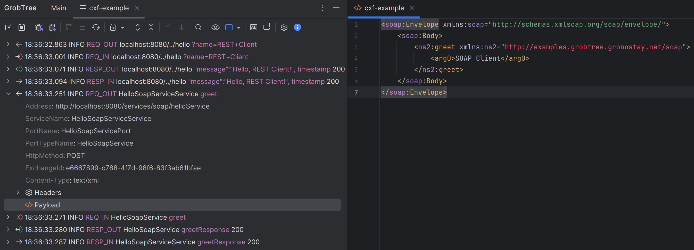

# GrobTree – Structured Log Intelligence for IntelliJ IDEA

GrobTree turns unstructured logs into an interactive tree that you can explore directly inside IntelliJ IDEA.  
Whether you are tailing a running process, importing archived logs, or building custom visualisations with your own extensions, GrobTree lets you jump from raw text to actionable insight in a few clicks.

For the full documentation set, visit the [docs index](./docs/README.md).

---

## Table of Contents
- [Feature Highlights](#feature-highlights)
- [Quick Start](#quick-start)
- [Documentation](#documentation)
  - [Documentation Index](./docs/README.md)
  - Onboarding: [Getting Started Guide](./docs/getting-started.md)
  - How-to Guides: [Using GrobTree](./docs/using-grobtree.md), [IntelliJ Settings](./docs/intellij-settings.md)
  - Reference: [Extending GrobTree](./docs/extending-grobtree.md)
- [Ecosystem Projects](#ecosystem-projects)
- [FAQ & Support](#faq--support)
- [Contact](#contact)

---

## Feature Highlights
- **One Log, Many Views** – Split raw logs into individual outputs using regex boundaries or single-line mode. Each output becomes a node with fully customisable captions, colours, icons, and metadata.
- **Live Streaming & Attachments** – Consume logs on-the-fly from IntelliJ run configurations, external processes, and file tails. GrobTree manages one tab per stream and keeps stripes/icons in sync with running state.
- **Rich Tree Navigation** – Expand/collapse top-level entries, inspect nested payloads, open correlated nodes, and jump straight into a common text editor to see the original snippet.
- **Search & Correlation** – Use the integrated find toolbar to highlight matching nodes. Corresponding-node comparers detect request/response pairs so you can traverse related log entries without scanning by hand.
- **Statistics & Metrics** – Capture runtime stats (durations, message counts, custom KPIs) from your top-node creators and visualise them in context.
- **Tailored for CXF & Beyond** – Ships with converters for popular stacks—including Apache CXF advanced logging—and can be tuned for any log style using the external configuration format.

---

## Quick Start
The bundled configuration is active until you point GrobTree at a custom file or JAR. To tour the default CXF example:

1. Open the GrobTree tool window and press **Open new tab**.  
2. In the new tab’s toolbar choose **Tab settings** and confirm that the RegEx preset **RFC 3339 timestamp and level** is selected.  
3. Click **Import logs**, then **Start Import**, and pick `examples/logs/cxf-example.log` from this repository.  
4. Once the import finishes, the tree should resemble the full CXF showcase below, with request/response nodes, statistics, and the synced raw output view.  

---

## Documentation
- [Documentation Index](./docs/README.md) – Central navigation for onboarding, how-to, and reference material.
- **Onboarding**
  - [Getting Started Guide](./docs/getting-started.md) – Installation, first-run setup, and demo project tour.
- **How-to Guides**
  - [Using GrobTree](./docs/using-grobtree.md) – Tool window overview, log tree navigation, and configuration file anatomy.
  - [IntelliJ Settings](./docs/intellij-settings.md) – Detailed walkthrough for configuring the IDE integration.
- **Reference**
  - [Extending GrobTree](./docs/extending-grobtree.md) – Public APIs, extension building blocks, and sample projects.

---

## Ecosystem Projects
| Project | Description |
| ------- | ----------- |
| [`grobtree-api`](https://central.sonatype.com/artifact/net.gronostay.grobtree/grobtree-api) | Public Java API for building GrobTree extensions. Available on Maven Central. |
| [`grobtree-testing`](https://github.com/bgronostay/grobtree-testing) | Demo projects (e.g., Apache CXF app) that emit logs suited for GrobTree evaluators. |
| [`grobtree-example-extension`](https://github.com/bgronostay/grobtree-example-extension) | Example JAR showing how to implement listeners, factories, and log providers. |

---

## FAQ & Support
- **Is the plugin open source?** – Not yet. This repository acts as the documentation and community hub while the code remains private.
- **Where do I report issues or request features?** – Use the GitHub issue tracker on this project. Include your IDE version, GrobTree plugin version, and anonymised sample logs/configuration snippets.
- **Can I contribute extensions?** – Absolutely. Fork the example extension, implement your logic, and share it as a standalone repository. Open an issue if you’d like it featured here.
- **How do I stay updated?** – Watch this repository (and the plugin release page) for announcements, changelog entries, and new binary drops.

---

### Contact
- Maintainer: **Bernd Gronostay**
- GitHub: [@bgronostay](https://github.com/bgronostay)

Have ideas or questions? Open an issue or start a discussion—GrobTree thrives on real-world feedback from the teams who rely on it.
