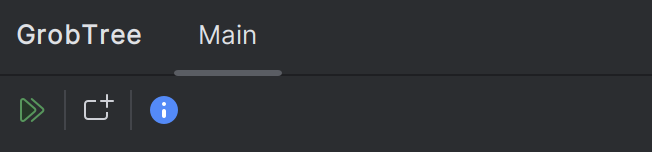
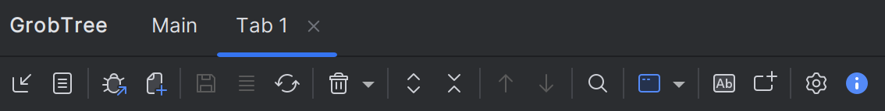

# GrobTree – Structured Log Intelligence for IntelliJ IDEA

GrobTree turns unstructured logs into an interactive tree that you can explore directly inside IntelliJ IDEA.  
Whether you are tailing a running process, importing archived logs, or building custom visualisations with your own extensions, GrobTree lets you jump from raw text to actionable insight in a few clicks.

---

## Table of Contents
- [Feature Highlights](#feature-highlights)
- [Quick Start](#quick-start)
- [Getting Started](#getting-started)
- [User Interface](#user-interface)
- [Exploring the Log Tree](#exploring-the-log-tree)
- [Configuring Log Parsing](#configuring-log-parsing)
- [Extending GrobTree](#extending-grobtree)
- [Ecosystem Projects](#ecosystem-projects)
- [FAQ & Support](#faq--support)

---

## Feature Highlights
- **One Log, Many Views** – Split raw logs into individual outputs using regex boundaries or single-line mode. Each output becomes a node with fully customisable captions, colours, icons, and metadata.
- **Live Streaming & Attachments** – Consume logs on-the-fly from IntelliJ run configurations, external processes, and file tails. GrobTree manages one tab per stream and keeps stripes/icons in sync with running state.
- **Rich Tree Navigation** – Expand/collapse top-level entries, inspect nested payloads, open correlated nodes, and jump straight into a common text editor to see the original snippet.
- **Search & Correlation** – Use the integrated find toolbar to highlight matching nodes. Corresponding-node comparers detect request/response pairs so you can traverse related log entries without scanning by hand.
- **Statistics & Metrics** – Capture runtime stats (durations, message counts, custom KPIs) from your top-node creators and visualise them in context.
- **Tailored for CXF & Beyond** – Ships with converters for popular stacks—including Apache CXF advanced logging—and can be tuned for any log style using the external configuration format.

---

## Quick Start
The bundled configuration is active until you point GrobTree at a custom file or JAR. To tour the default CXF example:

1. Open the GrobTree tool window and press **Open new tab**.  
2. In the new tab’s toolbar choose **Tab settings** and confirm that the RegEx preset **RFC 3339 timestamp and level** is selected.  
3. Click **Import logs**, then **Start Import**, and pick `examples/logs/cxf-example.log` from this repository.  
4. Once the import finishes, the tree should resemble the full CXF showcase below, with request/response nodes, statistics, and the synced raw output view.  


---

## Getting Started
### 1. Install the Plugin
1. Download the GrobTree plugin (ZIP) from the releases page.
2. In IntelliJ IDEA, open `Settings → Plugins → ⚙ → Install Plugin from Disk…`.
3. Restart the IDE to load the tool window (`View → Tool Windows → GrobTree`).

> GrobTree requires IntelliJ IDEA 2024.3+ (or any JetBrains IDE with the Platform module).

### 2. Point GrobTree to a Configuration
Open `Settings → Tools → GrobTree` and choose one of the following sources:
- **Internal configuration** – built-in defaults, ideal for a quick tour.
- **External file** – your own `ConverterConfig.xml`.
- **JAR resource** – a packaged extension that bundles converters and icons.

Optional: enable *Override tool window title/icon* to pull branding info from the selected config.

### 3. Import Logs
Inside the GrobTree tool window toolbar you can:
- Import from file (once-off or with follow/tail).
- Paste from the clipboard.
- Attach to a running IntelliJ run configuration (live or historical output).
- Tail an external file path.

Tabs are created on demand; you can rename, duplicate, clear, and persist them.

### 4. Try the Demo Project
The public [`grobtree-testing`](https://github.com/bgronostay/grobtree-testing) repository ships with **cxf-example**, a Spring Boot + Apache CXF application wired for verbose logging:
```bash
git clone https://github.com/bgronostay/grobtree-testing.git
cd grobtree-testing/cxf-example
./mvnw spring-boot:run
```
Attach GrobTree to the run configuration (Main toolbar → “Open tabs for running processes and start evaluating”) and watch live request/response nodes populate in the tree.

---
## User Interface
When the plugin loads for the first time the GrobTree tool window appears in a deliberately minimal state. IntelliJ prevents plugins from performing heavy initialisation before the user explicitly interacts with the UI, so GrobTree only renders a lightweight panel with two primary actions:

- **Open tabs for running configurations** – scans active run/debug processes and opens dedicated GrobTree tabs that immediately begin evaluating live output.
- **Open new tab** – creates an empty tab so you can import logs from disk, clipboard, or a file tail.



Once a tab is created the full toolbar, tree, search controls, and statistics features become available. This lazy-loading approach keeps IDE startup responsive while still giving you quick access to the complete GrobTree experience as soon as you need it.

The main action bar surfaces import, attach, search, and save controls as soon as a tab is active:



---

## Exploring the Log Tree
- **Main Toolbar** – manage tabs, attach/detach streams, save buffers, switch output representations (tree, JSON, XML, plain text).
- **Find Toolbar** – search across captions/content, iterate matches, toggle case sensitivity.
- **Context Menu** – open nodes in editors, copy structured payloads, invoke custom actions contributed by extensions.
- **Statistics Dialog** – display aggregated metrics per converter, optionally exported.

Selecting a node synchronises the common editor view, highlights search hits, and reveals corresponding nodes with bold styling and icons.

Below is a complete GrobTree view while analysing the CXF demo application, combining the tree, statistics, and corresponding raw output:

## Configuring GrobTree

### IntelliJ Settings
Open `Settings → Tools → GrobTree` to choose how the plugin sources its configuration. You can stay on the bundled defaults for a quick tour, point to an external `ConverterConfig.xml`, or load a JAR so GrobTree can resolve custom factories, icons, and resources. Toggling “Override tool window title/icon” applies branding metadata from the selected configuration, and the Advanced settings page exposes log-tail defaults, buffer sizes, and other power-user tweaks.

### ConverterConfig.xml
The `ConverterConfig.xml` file controls every stage of parsing and presentation. Its root element carries metadata (`name`, `version`, branding attributes) and enforces the schema version GrobTree expects (`config-version="1.2.0"`, optional `api-version`) so the plugin can refuse incompatible files before loading them.

- **Metadata & Branding** – attributes like `pluginName` and `pluginIconPath` let the configuration restyle the tool window when the user enables overrides in settings.
- **LogProviders** – define named ingestion pipelines and the `LogProviderListener` class (optionally via a factory) that converts raw text into structured messages.
- **Transformations** – configure search/replace steps that run before parsing, including enablement flags and toolbar icons for each transformation.
- **Factory** – registers the fully qualified factory class GrobTree calls when it needs to instantiate processing listeners or node creators exposed by extensions. Not needed if you use fqClassName when a class is to be specified.
- **RegExs** – declare patterns that split the log stream, capture named groups, and optionally derive timestamps from matches; patterns can be stored inline or Base64-encoded and support auto-creating params for named groups.
- **RunConfigs** – map IntelliJ run configurations to evaluation presets by referencing a `configId` and, if needed, a specific regex to apply while the process runs.
- **EvaluationConfigs** – bundle everything the tree renderer needs: selectable presets, a shared `CommonConfig`, parameter extraction rules, display styling, and processing listeners.
- **Parameters** – toggle global viewer behaviours such as whether GrobTree should auto-expand preferred nodes, de-duplicate lines, or restyle captions.
- **Variables** – define reusable key/value pairs that can be interpolated across the configuration, handy for reuse between listeners or regex definitions.
- **Icons** – map symbolic icon names to resource paths inside the configuration JAR so GrobTree can resolve custom artwork at runtime.

Within an `EvaluationConfig`, `ParamConfigs` expose captured fields in captions (with specialised handling for timestamps), `ParamDisplayConfigs` colourise or iconise key values, and `ProcessingListeners` wire in either GrobTree-provided or extension-provided tree builders. External listeners or factories referenced here inherit the `ClassCreationDefinition` contract, meaning they can be singletons, constructed via a factory, or parameterised dynamically.

The bundled `ConverterConfig.xml` inside the plugin is a helpful template, and the example extension ships a pared-down version that demonstrates custom log providers and listeners working together. Start from those files, layer in your own providers and regexes, and package everything into a JAR when you are ready to distribute it.

---

## Extending GrobTree
GrobTree exposes a stable public API to customise ingestion, processing, and presentation. The artifacts are published to Maven Central:
```xml
<dependency>
    <groupId>net.gronostay.grobtree</groupId>
    <artifactId>grobtree-api</artifactId>
    <version><!-- latest --></version>
</dependency>
```

### Extension Building Blocks
- **Factories (`net.gronostay.grobtree.api.processing.Factory`)** – Resolve named components from your JAR (e.g., processing listeners, node factories).
- **Processing Listeners** – Implement `ProcessingListener` to interpret log entries and populate the `LogTree`.
- **Log Providers** – Implement `LogProviderListener` to transform custom file formats into structured message buffers.
- **Top Node Creators & Statistics** – Create reusable building blocks that add domain-specific visualisations and expose metrics via `StatisticsProvider`.

### Sample Extension
The publicly available [`grobtree-example-extension`](https://github.com/bgronostay/grobtree-example-extension) demonstrates:
- A factory (`SampleExtensionFactory`) that returns components by `factoryUniqueName`.
- A processing listener that groups request/response pairs, attaches icons/colours, and marks corresponding nodes.
- A CSV log provider that injects metadata from custom-delimited logs.
- A ready-made `SampleConverterConfig.xml`, plus demo log files for quick testing.

Build it with Maven, point GrobTree’s settings to the produced JAR, and load the sample logs to see the end-to-end workflow.

---

## Ecosystem Projects
| Project | Description |
| ------- | ----------- |
| [`grobtree-api`](https://central.sonatype.com/artifact/net.gronostay.grobtree/grobtree-api) | Public Java API for building GrobTree extensions. Available on Maven Central. |
| [`grobtree-testing`](https://github.com/bgronostay/grobtree-testing) | Demo projects (e.g., Apache CXF app) that emit logs suited for GrobTree evaluators. |
| [`grobtree-example-extension`](https://github.com/bgronostay/grobtree-example-extension) | Example JAR showing how to implement listeners, factories, and log providers. |

---

## FAQ & Support
- **Is the plugin open source?** – Not yet. This repository acts as the documentation and community hub while the code remains private.
- **Where do I report issues or request features?** – Use the GitHub issue tracker on this project. Include your IDE version, GrobTree plugin version, and anonymised sample logs/configuration snippets.
- **Can I contribute extensions?** – Absolutely. Fork the example extension, implement your logic, and share it as a standalone repository. Open an issue if you’d like it featured here.
- **How do I stay updated?** – Watch this repository (and the plugin release page) for announcements, changelog entries, and new binary drops.

---

### Contact
- Maintainer: **Bernd Gronostay**
- GitHub: [@bgronostay](https://github.com/bgronostay)

Have ideas or questions? Open an issue or start a discussion—GrobTree thrives on real-world feedback from the teams who rely on it.
# GrobTree – Structured Log Intelligence for IntelliJ IDEA
