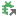

# GrobTree Toolbar Buttons

GrobTree exposes two stacked toolbars inside the IntelliJ tool window. The **primary toolbar** (top strip) hosts quick-start actions, and the **main toolbar** carries the controls you use while exploring logs. Every button is listed below with its IntelliJ icon (served from [intellij-icons.jetbrains.design](https://intellij-icons.jetbrains.design)), the action ID, and a description of what it does.

## Primary Toolbar (No Tab Opened)

| Icon | Purpose                                                                                                                  |
| --- |--------------------------------------------------------------------------------------------------------------------------|
|  | Scan all copen projects for running configurations, open GrobTree tabs for them, and start evaluating their live output. |
|  | Create an empty GrobTree tab so you can import or attach logs manually.                                                  |
|  | Show the “About GrobTree” panel with version details, links, and diagnostics.                                            |

## Main Toolbar (Log Exploration)

| Icon | Purpose |
| --- | --- |
|  | Open the import dialog to load logs from disk, clipboard, or a custom provider. |
|  | Re-run the last import with the previously chosen source and options. |
|  | Attach the current tab to a chosen IntelliJ run configuration and stream its output live. |
|  | Tail an external file and push new lines directly into the active GrobTree tab. |
|  | Toggle automatic evaluation for newly started run configurations (live attach on/off). |
|  | Persist the buffer of the current tree (including processed entries) to a file. |
|  | Open the buffered tree content in a regular editor tab for diffing or inspection. |
|  | Rebuild the tree from a previously saved buffer (useful after reloading a configuration). |
|  | Split button that exposes clearing commands. Default click clears the active tree. |
|  | Expand every node in the current tree. |
|  | Collapse the entire tree to top-level nodes. |
|  | Jump to the previous corresponding node (paired requests/responses, etc.). |
|  | Jump to the next corresponding node. |
|  | Open the search box scoped to the current GrobTree tab. |
|  | Remove active filters so every processed entry is displayed again. |
|  | Split button for opening the raw output tab. Offers XML, JSON, and plain text variants. |
|  | Rename the current GrobTree tab. |
|  | Quickly create a new tab from the main toolbar. |
|  | Edit tab-specific settings such as regex selection, display options, and listeners. |
|  | Open the information dialog for the active tab (configuration metadata, diagnostics). |
|  | Reapply the configuration defaults to the current tab when GrobTree detects changes. |

### Clear Tree Split Button

| Icon | Action ID | Purpose |
| --- | --- | --- |
| Icon | Purpose |
| --- | --- |
|  | Remove all entries from the active tree while keeping attachments intact. |
|  | Clear every tree that is currently attached to a running process. |

### Show Output Split Button

| Icon | Purpose |
| --- | --- |
|  | Open the original raw output in a side tab without changing its formatting. |
|  | Render the raw output with XML syntax highlighting. |
|  | Render the raw output with JSON syntax highlighting. |
|  | Render the raw output as plain text (no syntax highlighting). |

### Find Toolbar (Inside the Search Strip)

| Icon | Purpose |
| --- | --- |
|  | Focus the search field and apply the query to the current tree. |
|  | Toggle case-sensitive search. |
|  | Move to the previous search match. |
|  | Move to the next search match. |

### Tree Context Menu Highlights

These actions live in the tree context menu but are worth knowing when documenting buttons that appear with icons elsewhere.

| Icon | Purpose |
| --- | --- |
|  | Copy the selected node’s caption or value to the clipboard. |
|  | Save the value of the selected node to disk. |
|  | Collapse the selected set of top-level nodes into a synthetic group. |
|  | Compare nodes inside the current tab, project, or across projects. |
