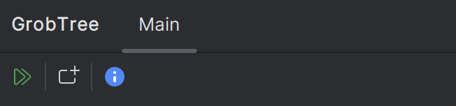
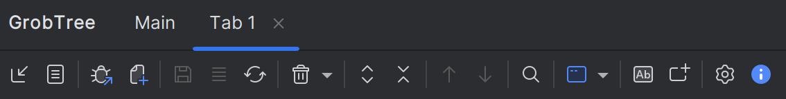

# GrobTree User Interface

When the plugin loads for the first time the GrobTree tool window appears in a deliberately minimal state. IntelliJ prevents plugins from performing heavy initialisation before the user explicitly interacts with the UI, so GrobTree only renders a lightweight panel with two primary actions:

- **Open tabs for running configurations** – scans active run/debug processes and opens dedicated GrobTree tabs that immediately begin evaluating live output.
- **Open new tab** – creates an empty tab so you can import logs from disk, clipboard, or a file tail.

Once a tab is created the full toolbar, tree, search controls, and statistics features become available. This lazy-loading approach keeps IDE startup responsive while still giving you quick access to the complete GrobTree experience as soon as you need it.

The main action bar surfaces import, attach, search, and save controls as soon as a tab is active:

You can find a button-by-button breakdown (with icon references) in the [Toolbar Buttons guide](./toolbar-buttons.md).
