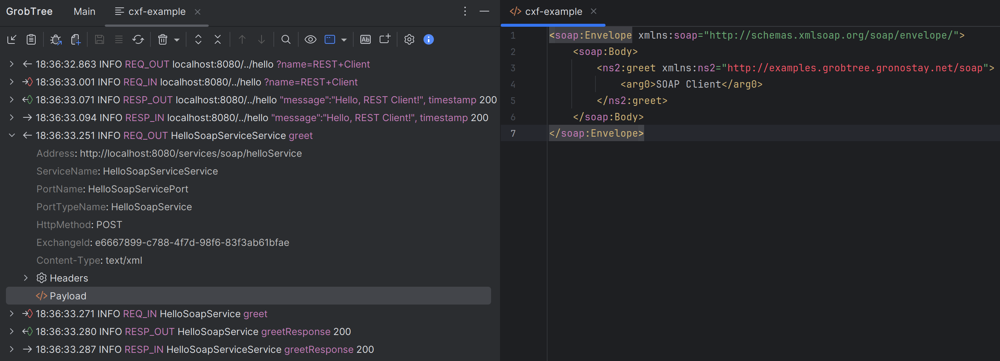

# Using GrobTree

## Exploring the Log Tree
- **Main Toolbar** – manage tabs, attach/detach streams, save buffers, switch output representations (tree, JSON, XML, plain text).
- **Find Toolbar** – search across captions/content, iterate matches, toggle case sensitivity.
- **Context Menu** – open nodes in editors, copy structured payloads, invoke custom actions contributed by extensions.
- **Statistics Dialog** – display aggregated metrics per converter, optionally exported.

Selecting a node synchronises the common editor view, highlights search hits, and reveals corresponding nodes with bold styling and icons.

## Tab Settings Dialog
Each GrobTree tab can override parsing and display rules through the tab-settings gear. The dialog is generated from the active `ConverterConfig.xml`, so panels appear only when the configuration defines matching elements.

- **Evaluation configs** – Lists every `<SelectableConfig>` from `<EvaluationConfigs>`. Pick the preset you want the tab to use; the remaining sections reflect the currently selected config.
- **Splitting** – Adjusts how GrobTree segments logs. It exposes the `<RegEx>` definitions together with split options supplied by `<LogToNodeConverterConfig>` (for example, single-line mode).
- **Processing** – Enables or disables node creators from `<ProcessingListeners>`. When a listener offers extra configuration, its controls appear here as nested sections.
- **Parameters** – Toggles caption components defined in `<ParamConfigs>` and additional caption fragments from `<TopNodeCaptionConfig>`.
- **Entries** – Mirrors `<ParamDisplayConfigs>`, letting you choose which level or status values can be highlighted when “Show all entries” is active.
- **Preferred Node** – Maps to `<TopLogNodeConfig>` so you can pick the sub-node GrobTree opens automatically when a top-level node is selected.
- **Miscellaneous** – Surfaces viewer flags from `<Parameters>` (auto-expand behaviour, duplicate suppression, buffer settings).
- **General ▸ Icons / Variables** – Appears when the configuration includes `<Icons>` or `<Variables>`. The dialog renders read-only tables so you can copy icon names or variable values while editing.

Press **OK** to apply the changes. If the evaluation config requests `reload-after-storing-configuration="true"`, GrobTree immediately rebuilds the current tree with the new settings.

## Configuring GrobTree

### IntelliJ Settings
Open `Settings → Tools → GrobTree` to choose how the plugin sources its configuration. You can stay on the bundled defaults for a quick tour, point to an external `ConverterConfig.xml`, or load a JAR so GrobTree can resolve custom factories, icons, and resources. Toggling “Override tool window title/icon” applies branding metadata from the selected configuration, and the Advanced settings page exposes log-tail defaults, buffer sizes, and other power-user tweaks.

### ConverterConfig.xml
The `ConverterConfig.xml` file controls every stage of parsing and presentation. Its root element carries metadata (`name`, `version`, branding attributes) and enforces the schema version GrobTree expects (`config-version="1.2.0"`, optional `api-version`) so the plugin can refuse incompatible files before loading them.

- **Metadata & Branding** – attributes like `pluginName` and `pluginIconPath` let the configuration restyle the tool window when the user enables overrides in settings.
- **LogProviders** – define named ingestion pipelines and the `LogProviderListener` class (optionally via a factory) that converts raw text into structured messages.
- **Transformations** – configure search/replace steps that run before parsing, including enablement flags and toolbar icons for each transformation.
- **Factory** – registers the fully qualified factory class GrobTree calls when it needs to instantiate processing listeners or node creators exposed by extensions. Not needed if you use fqClassName when a class is to be specified.
- **RegExs** – declare patterns that split the log stream, capture named groups, and optionally derive timestamps from matches; patterns can be stored inline or Base64-encoded and support auto-creating params for named groups.
- **RunConfigs** – map IntelliJ run configurations to evaluation presets by referencing a `configId` and, if needed, a specific regex to apply while the process runs.
- **EvaluationConfigs** – bundle everything the tree renderer needs: selectable presets, a shared `CommonConfig`, parameter extraction rules, display styling, and processing listeners.
- **Parameters** – toggle global viewer behaviours such as whether GrobTree should auto-expand preferred nodes, de-duplicate lines, or restyle captions.
- **Variables** – define reusable key/value pairs that can be interpolated across the configuration, handy for reuse between listeners or regex definitions.
- **Icons** – map symbolic icon names to resource paths inside the configuration JAR so GrobTree can resolve custom artwork at runtime.

Within an `EvaluationConfig`, `ParamConfigs` expose captured fields in captions (with specialised handling for timestamps), `ParamDisplayConfigs` colourise or iconise key values, and `ProcessingListeners` wire in either GrobTree-provided or extension-provided tree builders. External listeners or factories referenced here inherit the `ClassCreationDefinition` contract, meaning they can be singletons, constructed via a factory, or parameterised dynamically.

The bundled `ConverterConfig.xml` inside the plugin is a helpful template, and the example extension ships a pared-down version that demonstrates custom log providers and listeners working together. Start from those files, layer in your own providers and regexes, and package everything into a JAR when you are ready to distribute it.
